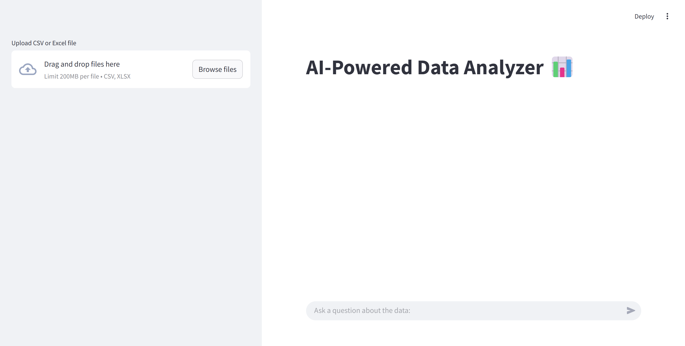
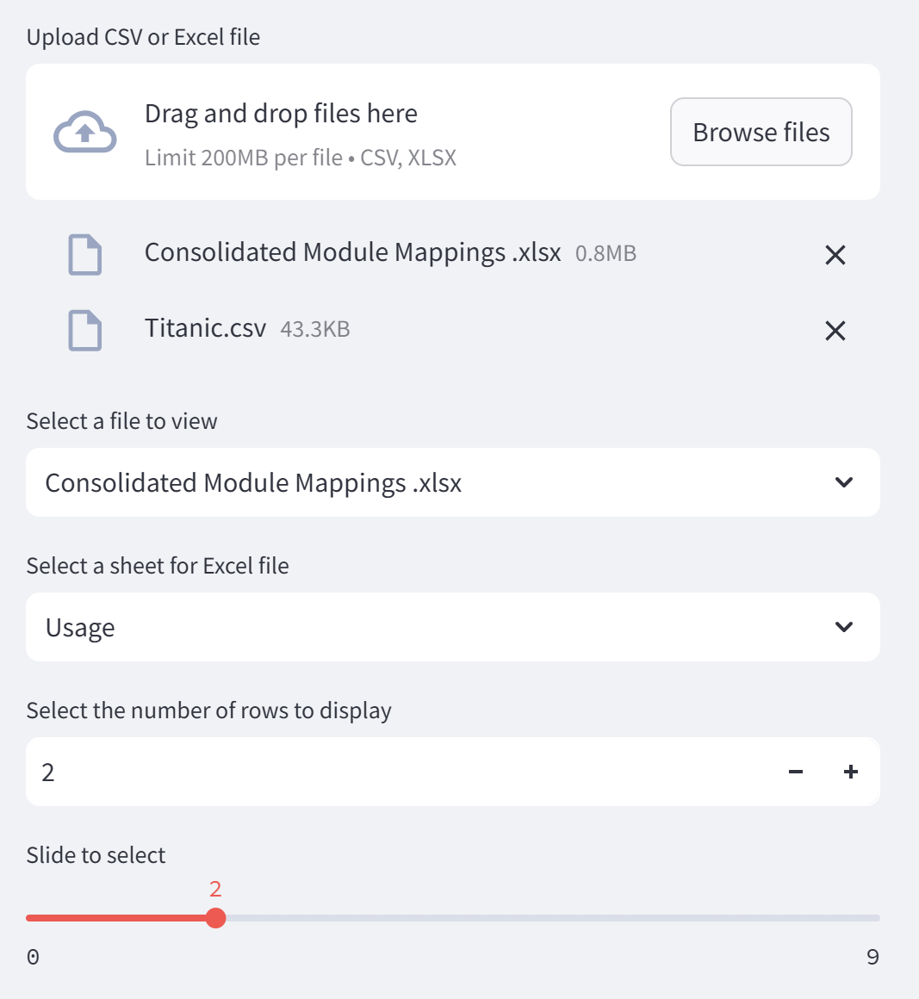
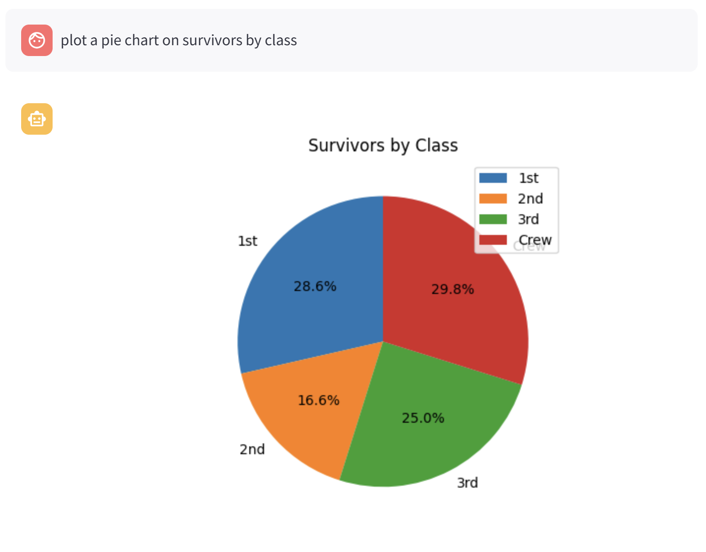

## AI-Powered Data Analyzer App 📊

You are finding a faster way to understand your data? This is your solution.

Visit our Data Analyzer App [here]() and enjoy exploring your data.

### Getting Started
1. **Upload data files:** Drag and drop your data file into the app. Only files of type .csv or .xls are accepted. 
    
    You can upload more than 1 data files.

1. **View data files:** Select the data file, data sheet and number of rows you would like to view in the respective order.

1. Ask your Data Analyzer any questions about your data by typing into the text area.

### Acknowledgments
Slider: https://discuss.streamlit.io/t/circular-connection-of-slider-and-text-input/11015/4

ChatGPT OpenAI: Upload, accepting inputs

Chat interface: https://www.youtube.com/watch?v=jpoqXbvP6Co&t=432s